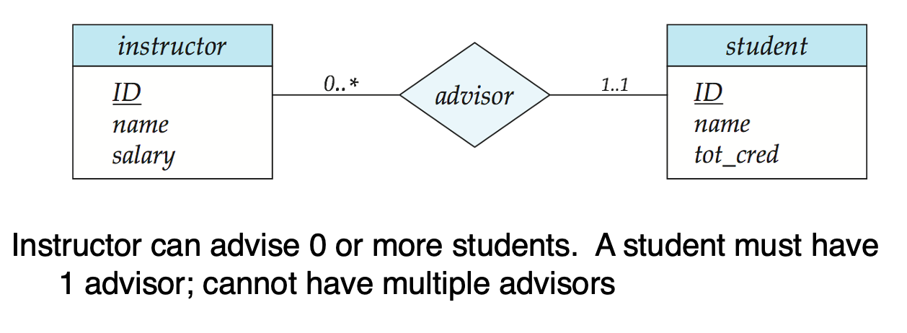
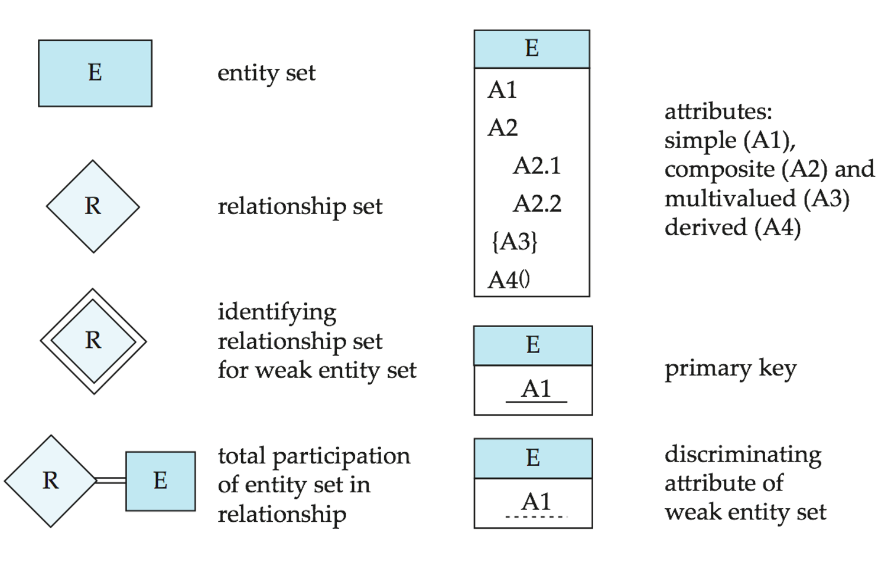
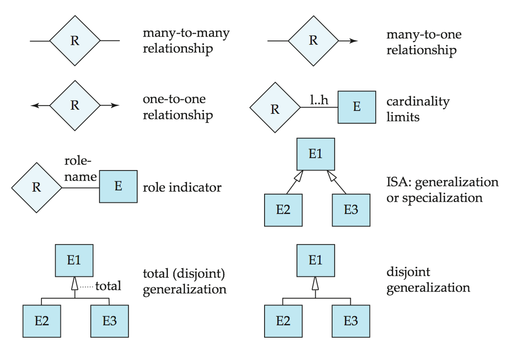

# ebook-database-system
This repo will touch some knowledge about database system.


1. DB Structure
  - relational vs hierarchical vs network
  -  database system: 
    -  management & access + meta-data + collection of data
  - types of databases:
    - alpha-numeric DB (OLTP)
    - multimedia
    - geograhic (GIS)
    - data warehouse (OLAP)
    - real-time and active DB (sensor data)
    - and so on...
  - entity-relationship model (ER Model): schema + instance
    - entities (tables), keys, attributes (fields, domain*), data (rows, records, instances)
      - simple vs composite attr
      - single vs multivalued attr
      - derived attr
    - relationships/constraints: association between entites
      - one-to-one 1:1
      - one-to-many 1:N
      - many-to-one N:1
      - one-to-many N:N
    - roles: keys that define relationships?
    - total and partial participation (double line):
      - total: every entity in the set participates at least one relation in the relationship set
      - partial: some entities may not participate in any relationship in the set
    - notation: A line may have an associated minimum and maximum cardinality, shown in the form l..h, where l is the minimum and h the maximum cardinality
    - e.g. instructor can advise 0 student or as many as he/she like; student can have one and only one advisor 
      
    - weak entity (double rectangle) vs strong entity
      - discriminator
      - identifying relationship
    - Specialization
      - overlapping
      - disjoint
      
      

2. Queries (relational algebra, SQL)
  - table creation syntax:
    - **Name of attribute** **Domain of attribute** ***Row Constraint*
      **Table Constraint**
      - Domain Type:
        - CHAR(n): fix len character string with user-specified len n; single-quote
        - VARCHAR(n): variable len char with maximum length n
        - INT: integer
        - SMALLINT: samll integer, machine-dependent
        - NUMERIC(p,d): fixed pt number, with user-specified precision of p digits, with d digits to the right of deciml pt. (e.g. numeric(3,1) allows 44.5 to be stored
        - REAL,DOUBLE PRECISION
        - FLOAT(N)
        - TEXT
        - DATE
        - TIMESTRAMP
        - LINE
        - INTERVAL
    - comparsion of strings
      - 'foo' < 'foobar'
      - 'foo'  > 'fodder'
    - creation
      E.g. 
      ```
      CREATE TABLE *table-name*(DNAME VARCHAR(10) NOT NULL,
                                DFNAME VARCHAR(10) DEFAULT 'NULL',
                                DNUM INTEGER *row-constraint-2*,
                                ...
                                PRIMARY KEY(DNAME, DFNAME),
                                UNIQUE(DFNAME, ....),
                                FOREIGN KEY(DFNAME) REFERENCES **foregin-table**
                                ON DELETE SET DEFAULT
                                ON UPDATE CASCADE/SET NULL,
                                CONSTRAINT *Dnum_check* CHECK(DNUM > 0),
                                *table-constraint-2*);
      ```
      E.g.
      ```CREATE TABLE *schema0name*(...)```
     
  - Modification
      adding new attr to an existing table, default to NULLs
      ```ALTER TABLE *table-name* ADD JOB VARCHAR(12) ```
      ```ALTER TABLE *table-name* DROP *column-name*```
      update
      ```UPDATE ```
  - Deletion
      ``` DROP TABLE *table-name* ```
      ``` DROP SCHEMA *schema-name* ```
      ``` DROP DATABASE *DB-name* ```
      
  - Relational Model Operations
    - Selection
      ```
      SELECT *
      FROM Movies
      WHERE studioName = 'Disney' AND year = 1990
      ```
      
    - Projection
    - ```
      SELECT title, length
      FROM Movies
      WHERE studioName = 'Disney' AND year = 1990
      ```
   - Union
   - Set Difference
   - Product
   - Join
 - Other Operations
   - Alias
   - Like   
     ```*string* LIKE *pattern*```
   - Ordering output
     ```ORDER BY  *attr-A + attr-B* DESC/ASC```
- Normalization
- Design Principles
- Testing
- Optimization
