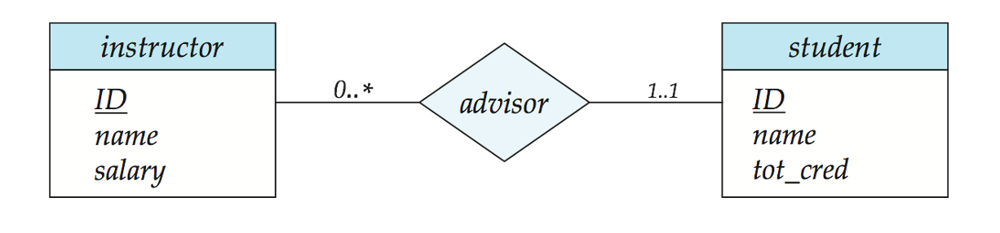

# ebook-database-system
This repo will touch some knowledge about database system.

1. DB Structure
  - relational vs hierarchical vs network
  -  database system: 
    -  management & access + meta-data + collection of data
  - types of databases:
    - alpha-numeric DB (OLTP)
    - multimedia
    - geograhic (GIS)
    - data warehouse (OLAP)
    - real-time and active DB (sensor data)
    - and so on...
  - entity-relationship model (ER Model): schema + instance
    - entities (tables), keys, attributes (fields, domain*), data (rows, records, instances)
      - simple vs composite attr
      - single vs multivalued attr
      - derived attr
    - relationships/constraints: association between entites
      - one-to-one 1:1
      - one-to-many 1:N
      - many-to-one N:1
      - one-to-many N:N
    - roles: keys that define relationships?
    - total and partial participation (double line):
      - total: every entity in the set participates at least one relation in the relationship set
      - partial: some entities may not participate in any relationship in the set
    - notation: A line may have an associated minimum and maximum cardinality, shown in the form l..h, where l is the minimum and h the maximum cardinality
    - e.g. instructor can advise 0 student or as many as he/she like; student can have one and only one advisor 
      
    - weak entity (double rectangle) vs strong entity
      - discriminator
      - identifying relationship
    - Specialization
      - overlapping
      - disjoint
      
      

2. Queries (relational algebra, SQL)

- Normalization
- Design Principles
- Testing
- Optimization
